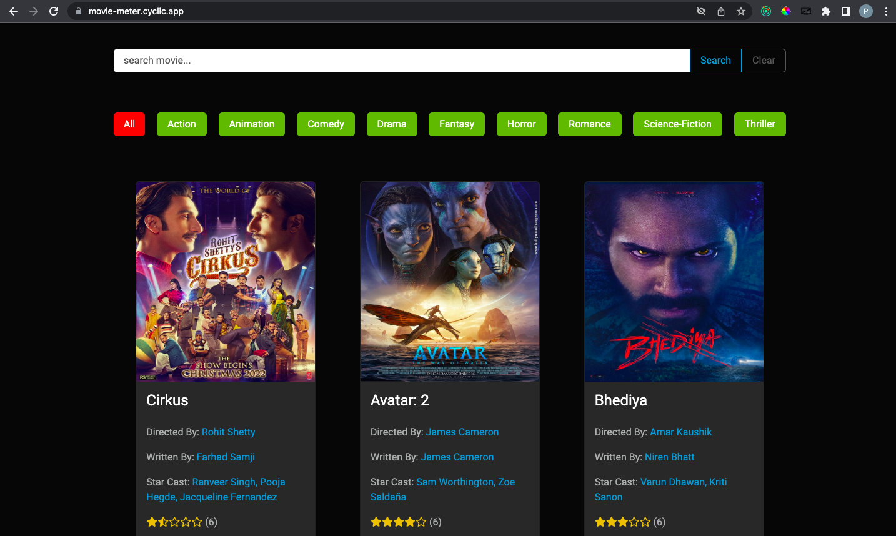

# Project - MOVIE METER FULL STACK APP BUILD WITH MERN 

## **Overview of the Project** 

- Movie meter is movie rating app where user can review movie by giving stars and write about movie experience, user can also add movies to watched list.

## **Project Features**

 - User Dashboard for Managing Reviews and Profile
 - User Authentication & Route Protection
 - Admin Dashboard for Managing Users and Movies
 - Showing Average Rating of a Movie
 - Showing All Reviews for a Movie 
 - Search Movies by Categories
 - Add Movie to the Watched list 

 
 ## **Tech Used**

 - Bootstrap as CSS framework
 - ReactJs as Frontend Javascript Library
 - React Router for Routing Pages
 - Redux for State Managment
 - ExpressJs as Backend Serverside Framewrok
 - JSON Web Token to create and maintain Token for Authentication
 - Cloudinary for Storing Images of Movies
 - Mongoose for Mongo DB as Database

---

### **Time Duration to Build the Project:-**

- It took me around 25 days to Build the complete App. 

---

LIVE LINK:- [Movie Meter](https://movie-meter.cyclic.app/)

---

## **About me**

#### **Hey, I'm Piyush Umale**

- I live in Nagpur, Maharashtra. I'm on a journey to learn Full Stack Web Development.

---

## **Feedback**
- Feedbacks are always appreciated. piyush7uml@gmail.com